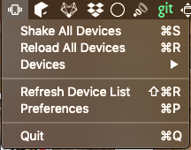
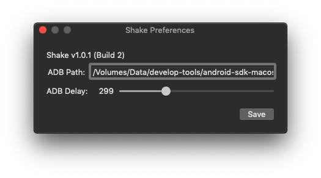

# Shake

A small macOS status bar application that allows you trigger the shake action 
and the 'Reload JS' development option in React Native on Android simulators.

Before using Shake you should setup your ADB path, and millisecond delay between adb commands under preferences.
I'd recommend that you leave ADB Delay set around 300ms, but feel free to play around with it.

Happy Devving
